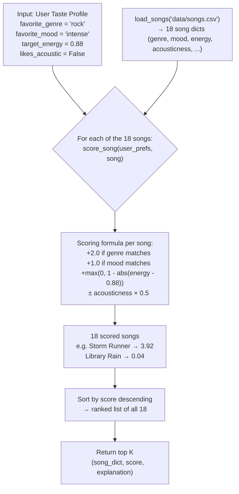

# 🎵 Music Recommender Simulation

## Project Summary

This project builds a simple content-based music recommender that simulates what apps like Spotify or TikTok do at a small scale. Instead of machine learning or user history, my version uses a fixed taste profile and scores every song in the catalog against a few key features: genre, mood, energy level, and acoustic quality. The goal was to understand how raw song data actually gets turned into a ranked list of recommendations — and to think honestly about where a system this simple might go wrong.

---

## How The System Works

Real recommendation systems like Spotify's Discover Weekly or TikTok's For You page combine signals from listening history, what similar users liked, and the audio features of songs themselves. My version skips all of that and focuses on just one part: content-based filtering. That means I compare what the user says they like directly against what each song actually is — no learning from behavior, no crowd data.

My version prioritizes songs that match the user's genre and mood preferences first, then uses energy as a tiebreaker, and factors in acoustic quality as a small bonus or penalty. The tradeoff is simplicity and transparency — you can trace exactly why a song ranked where it did — but it also means the system is completely frozen around whatever the user profile says. It will only ever reward what the profile explicitly lists.

### Song Features Used

After analyzing the feature distributions across all 18 songs in the catalog, I chose these four features for scoring:

| Feature | Type | Spread in catalog | Why it matters |
|---|---|---|---|
| `genre` | string | 15 unique values | Strongest categorical signal — it captures the broadest style preference |
| `mood` | string | 14 unique values | Secondary signal — more fluid than genre, but still a strong differentiator |
| `energy` | float 0.0–1.0 | 0.22 – 0.96 (spread 0.74) | Wide numeric range makes it useful for proximity scoring |
| `acousticness` | float 0.0–1.0 | 0.04 – 0.97 (spread 0.93) | Widest spread of any numeric feature — great for separating electronic from acoustic |

`tempo_bpm`, `valence`, and `danceability` are stored in the CSV but not used in the scoring formula. Tempo overlaps heavily with energy as a signal, and valence/danceability have narrower spreads (0.55 and 0.69 respectively) that add complexity without much payoff at this scale.

### User Profile

The `UserProfile` stores the listener's stated preferences. For this simulation it is:

```python
user_prefs = {
  "favorite_genre": "rock",
  "favorite_mood": "intense",
  "target_energy": 0.88,
  "likes_acoustic": False,
}
```

This profile is strong enough to separate intense rock from chill lofi because it lines up genre, mood, and energy all pointing in the same direction. It is intentionally narrow — that makes it a clear test case, but it would not work well for someone whose taste crosses multiple genres or moods.

### Algorithm Recipe

**Scoring Rule (applied to one song at a time):**

The total score for a single song is the sum of these weighted points:

- `+2.0` for a genre match — genre gets the highest weight because it is the strongest signal for what kind of music someone wants
- `+1.0` for a mood match — mood matters but is more flexible, so it gets half the genre weight
- `+0.0 to +1.0` for energy proximity: `energy_points = max(0, 1 - abs(song_energy - target_energy))`
  - A song at exactly the target energy scores 1.0; songs further away score less and hit 0 if they differ by 1.0 or more
- `+0.0 to +0.5` acoustic bonus when `likes_acoustic` is True: `acousticness * 0.5`
- `-0.0 to -0.5` acoustic penalty when `likes_acoustic` is False: `acousticness * 0.5` subtracted
  - This reflects that a non-acoustic listener would actively dislike a very acoustic song

I verified the weights against the actual catalog before implementing them. For the rock/intense profile, **Storm Runner** (rock, intense, energy 0.91, acousticness 0.10) scores **3.92**, while **Library Rain** (lofi, chill, energy 0.35, acousticness 0.86) scores **0.04**. That spread of nearly 4 points confirms the weights clearly separate the target songs from the opposite end of the catalog.

**Ranking Rule (applied after all songs are scored):**

Once every song in the catalog has an individual score, the system sorts all scores from highest to lowest and returns the top K. Scoring and ranking are kept as two separate steps on purpose — a song can be evaluated on its own, but ranking only makes sense after the whole catalog has been compared.

**Expected Biases:**

One thing I noticed while planning this: because genre gets 2.0 points and mood only gets 1.0, a song that matches the genre but completely misses the mood will still outrank a song that nails the mood but is in the wrong genre. That could frustrate users whose taste crosses genre lines. There is also a filter bubble risk — a profile locked to "rock + intense" will never surface jazz, soul, or reggae songs, even if they score well on energy and mood. The system only rewards what the profile explicitly says; anything outside those categories gets silently passed over.

### Data Flow Diagram



This diagram matches the actual code path: `load_songs` feeds 18 dicts into a loop, each goes through `score_song` which applies the four-part formula, and then all scores are sorted to produce the final top-K list. The scoring step is independent — any single song can be scored in isolation — but the ranking step requires the full set.

---

## Getting Started

### Setup

1. Create a virtual environment (optional but recommended):

   ```bash
   python -m venv .venv
   source .venv/bin/activate      # Mac or Linux
   .venv\Scripts\activate         # Windows

2. Install dependencies

```bash
pip install -r requirements.txt
```

3. Run the app:

```bash
python -m src.main
```

### Running Tests

Run the starter tests with:

```bash
pytest
```

You can add more tests in `tests/test_recommender.py`.

---

## Experiments You Tried

Use this section to document the experiments you ran. For example:

- What happened when you changed the weight on genre from 2.0 to 0.5
- What happened when you added tempo or valence to the score
- How did your system behave for different types of users

---

## Limitations and Risks

Summarize some limitations of your recommender.

Examples:

- It only works on a tiny catalog
- It does not understand lyrics or language
- It might over favor one genre or mood

You will go deeper on this in your model card.

---

## Reflection

Read and complete `model_card.md`:

[**Model Card**](model_card.md)

Write 1 to 2 paragraphs here about what you learned:

- about how recommenders turn data into predictions
- about where bias or unfairness could show up in systems like this


