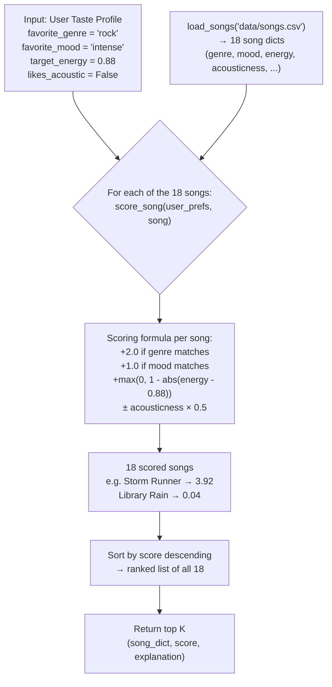

# Music Recommender Simulation

## Project Summary

This project builds a simple content-based music recommender that simulates what apps like Spotify or TikTok do at a small scale. Instead of machine learning or user history, my version uses a fixed taste profile and scores every song in the catalog against a few features: genre, mood, energy level, and acoustic quality. I mostly wanted to understand how raw song data actually becomes a ranked list — and figure out where something this simple starts to break.

---

## How The System Works

Real systems like Spotify's Discover Weekly or TikTok's For You page combine listening history, what similar users liked, and the audio features of songs. My version only does the last part — content-based filtering. I compare what the user says they like directly against what each song is. No learning from behavior, no crowd data.

Genre and mood matches give flat point bonuses. Energy uses a closeness formula so songs near the user's target score higher. Acoustic quality adds a small bonus or penalty depending on the user's preference. Because every point is traceable, you can tell exactly why a song ranked where it did.

### Features Used

I picked four core features for scoring: `genre`, `mood`, `energy`, and `acousticness`. I also added five extended features: `popularity`, `release_decade`, `detailed_mood`, `language`, and `explicit`. Tempo, valence, and danceability are in the CSV but I left them out of scoring — tempo overlaps too much with energy, and the others didn't add much at this catalog size.

### User Profile

The baseline profile:

```python
user_prefs = {
    "favorite_genre":      "rock",
    "favorite_mood":       "intense",
    "target_energy":       0.88,
    "likes_acoustic":      False,
}
```

The extended profile adds:

```python
    "target_popularity":    75,
    "preferred_decade":     "2010s",
    "target_detailed_mood": "aggressive",
    "allow_explicit":       True,
```

All extended fields have defaults so existing tests still pass without changes.

### Scoring

| Signal | How it's calculated | Default weight |
|---|---|---|
| Genre match | flat bonus if exact match | 2.0 |
| Mood match | flat bonus if exact match | 1.0 |
| Energy closeness | `max(0, 1 - abs(song_e - target_e)) × w` | 1.0 |
| Acoustic preference | `±acousticness × w` | 0.5 |
| Popularity closeness | `(1 - abs(pop_diff) / 100) × w` | 0.5 |
| Decade match | flat bonus if exact match | 0.5 |
| Detailed mood match | flat bonus if exact match | 1.5 |
| Explicit filter | hard −10 if user opts out | — |

You can switch the weight profile using a scoring mode:

- `balanced` — default, all signals weighted equally
- `genre-first` — genre is worth ×4, everything else is a tiebreaker
- `mood-first` — detailed mood dominates
- `energy-focused` — energy closeness is worth ×3, good for workout playlists
- `discovery` — popularity is penalized to surface lesser-known tracks

There's also a `--diversity` flag that runs a greedy reranker after scoring. It applies an artist penalty (−1.5 per repeat) and a genre penalty (−0.75 per extra appearance beyond the second) so one artist or genre can't take up all five slots.

### Data Flow



---

## CLI Output

Running `python -m src.main` produces:


---

## Profile Outputs

I ran five different profiles to see how the system behaves across different listener types.

**Profile 1 — High-Energy Pop**


**Profile 2 — Chill Lofi**


**Profile 3 — Deep Intense Rock**


**Profile 4 — Adversarial (Classical Rage)**


**Profile 5 — Edge Case (Loud & Acoustic)**


Chill Lofi and Deep Intense Rock matched what I expected. Classical Rage was the most interesting failure — Winter Cathedral (energy 0.22, contemplative) ranked #1 for a user wanting intense high-energy classical, purely because it was the only classical song in the catalog. The Loud & Acoustic profile felt generic because no folk songs exist, so the system just grabbed the nearest acoustic matches without flagging the gap.

---

## Getting Started

### Setup

1. Create a virtual environment (optional but recommended):

   ```bash
   python -m venv .venv
   source .venv/bin/activate      # Mac or Linux
   .venv\Scripts\activate         # Windows
   ```

2. Install dependencies:

   ```bash
   pip install -r requirements.txt
   ```

3. Run:

   ```bash
   python -m src.main                                          # all profiles, balanced mode
   python -m src.main "Chill Lofi"                             # single profile
   python -m src.main "Deep Intense Rock" genre-first          # pick a scoring mode
   python -m src.main "High-Energy Pop" mood-first --diversity # diversity reranking
   python -m src.main --list-modes                             # show all scoring modes
   ```

### Running Tests

```bash
pytest
```

---

## Experiments

**Weight shift (genre halved, energy doubled):** Chill Lofi and Deep Intense Rock barely changed. For Classical Rage, Winter Cathedral dropped from #1 to #3 — replaced by Storm Runner and Gym Hero which matched on mood and energy. That told me the default weights overfit to genre for unusual profiles.

**Profile diversity test:** The Loud & Acoustic profile (folk + high energy + acoustic) returned generic results because no folk songs exist. The system didn't say anything about the missing genre — it quietly grabbed the nearest acoustic matches instead.

**Manual score check:** I calculated scores by hand for Storm Runner (3.92) and Library Rain (0.04) before writing the code, then confirmed the function matched. This caught a weight bug early.

---

## Limitations

- 18-song catalog — most genres have exactly one song, so genre matching is basically a lottery for rare genres
- The genre weight (2.0) is strong enough to surface the wrong song from the right genre, which the Classical Rage test showed clearly
- Filter bubbles: a rock listener never sees jazz or soul, even if those songs match well on energy and mood
- No lyrics, cultural context, or listening history — only the features it was given
- The catalog is almost entirely Western and English-language, so whole regions of music are just missing

---

## Reflection

[**Model Card**](model_card.md)

Building this showed me that a recommender isn't just math — it's a set of values baked into numbers. Choosing genre = 2.0 and mood = 1.0 is actually saying "what kind of music matters more than how it makes you feel." What caught me off guard was how convincing the plain-language explanations made the system look, even though the logic underneath is just three additions. A user reading "matches your favorite genre | energy score 0.97" might trust that result more than they should.

The filter bubble thing stuck with me most. The rock profile never once surfaced a jazz, soul, or reggae song — not because those were bad matches, but because the formula had no way to value cross-genre similarity. In a real product used by millions of people, that kind of invisible narrowing would quietly shape what people think music even sounds like, and most users would never know it was happening.
